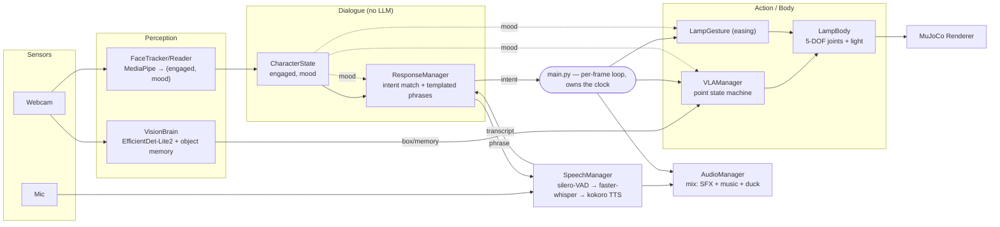
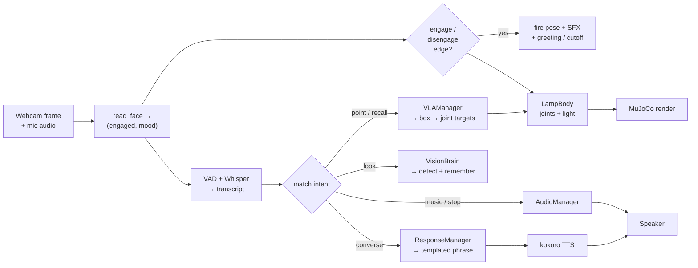

# Interactive Lamp — Technical Note

A live expressive character on a simulated 5-DOF MuJoCo lamp. The lamp perceives a
person through a webcam and microphone and responds with coordinated **motion,
light, voice, sound effects, and music**. Everything runs on-device, CPU-only, with
no LLM and no cloud calls.

## Architecture

Solid arrows carry data (frames, transcript, detections, joint/light targets, audio).
Dotted `mood` edges are shared state: mood affects **how** things are delivered
(motion timing, phrasing, gesture energy), never what the lamp actually says.

## Data flow

One pass of the per-frame loop, following a spoken command from sensor to actuator:

Every stage is non-blocking: perception, transcription, and audio run on their own
threads, and the loop advances each subsystem once per frame regardless of whether a
command is in flight. Interaction stages run only while engaged; a disengage edge
cuts speech, drops any pending transcript, and clears in-progress look/point state.

## Protocol

The whole system runs in one process with a single **main loop** in `main.py`. Every
subsystem has a `step(dt)` method, and the loop calls each one once per frame. The
subsystems hand their results back to the loop and never call each other.

Those results are simple, typed values:

- perception → `(is_engaged, mood)`
- speech → a transcript `str`
- action → a `PointResult`
- vision → a list of `Detection`

Slow work stays off the loop. Mic capture, Whisper transcription, and audio playback
each run on their own thread. The loop just **checks** them each frame
(`take_transcript()`, `take_result()`) and moves on. So a slow transcription never
freezes the rendering or motion. The result is that each part clearly owns its own
job, and the loop stays simple and easy to follow.

## Model-to-action

Each model's output is turned into actual lamp movement, not just printed to screen:

- **Engagement:** MediaPipe face landmarks → head-yaw / gaze thresholds →
  `is_engaged`. A rising edge fires the ENGAGE pose, power-on SFX, and a greeting; a
  falling edge fires DISENGAGE, power-off SFX, and stops music. Mood (from facial
  expression) selects the delivery variant.
- **Point-at-object (VLA):** EfficientDet-Lite2 returns a box → center normalized to
  `[-1, 1]` → mapped to `NECK_YAW` (mirrored pan, anchored level) and `HEAD_PITCH`
  (anchored to the engage pose) → eased over time by `LampGesture` into MuJoCo joint
  targets. On arrival the lamp re-detects and corrects once if it has drifted, reports
  verbally, holds, then self-returns to the engage pose. A state machine
  (`IDLE→MOVING→HOLDING→RETURNING→IDLE`) guards concurrency.
- **Speech intents:** the transcript is matched against templated intents (music /
  stop / point / recall / look / converse), which is deterministic string/keyword matching.
  No generative model, so behavior is predictable and cheap.

## Simulation

The lamp is a 5-DOF MuJoCo model (`lamp.xml`) with a controllable light. Motion is
made by setting **joint targets** and easing toward them over time, instead of
snapping instantly between poses, so the movement speeds up and settles naturally.
The view uses an orbit camera framing the lamp at 960×720. The webcam sits in the
world, not on the lamp's head, so "point at X" is a **one-shot** aim from a single
snapshot, not live tracking.

## Deployment

Target: Ubuntu 24.04, 4-core, 8 GB, **no GPU**. CPU-only throughout — `requirements.txt`
pins the CPU PyTorch wheel. System deps: `libportaudio2`, `libsndfile1` (audio),
`libgl1 libegl1 libgles2 libglib2.0-0` (MuJoCo/OpenCV). Two vision models ship in
`models/`; the speech models (Whisper base int8, kokoro, silero-VAD) auto-download
from Hugging Face on first run and cache under `~/.cache/`. Audio and camera use the
standard Linux stack (ALSA → PipeWire); on a headless/SSH session with no sound
server or camera the app still starts and degrades gracefully. Launch from `src/`
(`python main.py`); full steps in `SETUP.md`.

## Key design choices

- **One manager per subsystem.** The system is split into focused managers —
  `VisionBrain`, `SpeechManager`, `ResponseManager`, `VLAManager`, `AudioManager`,
  and the `LampBody`/`LampGesture` pair — each owning a single concern (perception,
  speech I/O, dialogue, pointing, sound, and motion, respectively). Each manager
  hides its own models, threads, and state behind a small interface, exposing a
  `step(dt)` method plus a few typed accessors. This keeps the boundaries clean, so
  a subsystem can be swapped or tested in isolation and `main.py` reads as a short
  list of coordinated managers rather than tangled logic.
- **One loop owns time.** A single per-frame loop drives every manager — simpler and
  more debuggable than an event/actor system; heavy work is pushed to threads and
  polled so the loop never blocks.
- **No LLM.** Using fixed, intent-based replies keeps it fast, free to run, and
  predictable on an 8 GB CPU machine.
- **Everything reacts together.** Engaging and disengaging fire motion, light, and
  sound effects at the same time, and music quiets down on its own while the user talks.

## Measurements

Engagement reliability and memory were measured directly. The latency, frame-rate,
and CPU figures are **estimates** based on the known cost of the models used
(silero-VAD, faster-whisper base int8, kokoro, MediaPipe, EfficientDet-Lite2) on a
CPU. Each row is labeled. Memory was read on the Windows development machine, so the
target may differ; the other estimates are meant as a rough range. How to capture the
exact figures is noted after the table.

| Metric | Value |
|---|---|
| Engagement — correct engage on approach | **20 / 20** (measured) |
| Engagement — spurious/incorrect fires (20 trials) | **0** (measured) |
| Response latency — end-of-speech → transcript (Whisper base int8) | ~0.6–1.5 s (est.) |
| Response latency — transcript → first TTS audio (kokoro) | ~0.2–0.6 s (est.) |
| Render loop rate (idle) | ~30 fps (est.) |
| CPU — steady state | ~60–120% of 400% (≈0.6–1.2 cores) (est.) |
| CPU — transient (Whisper transcription) | up to ~250–350% (est.) |
| Memory — resident set | **~2.5 GB** (measured, Windows dev box) |

## Known limitations

- **Open-mic picks up the speaker.** With no echo cancellation, loud music/TTS can be
  re-captured by the mic; mitigated by ducking music while listening.
- **Pointing is directional, not true 3D aim.** The webcam is world-fixed and not
  co-located with the lamp, so the system only maps the object's 2D image position
  to a pan/tilt direction. The lamp therefore points in the object's *general* direction rather than precisely at
  it, and the aim is a single snapshot (corrected once on arrival) rather than
  continuous tracking. On a real robot with a head-mounted camera, or a known
  camera-to-lamp transform, this becomes a genuine point at where the object was
  last seen.
- **Fixed detector vocabulary.** Object recall/pointing is limited to the COCO-80
  classes EfficientDet knows; out-of-vocabulary objects can't be named or pointed at.
- **Fixed dialogue.** Replies are chosen by matching patterns, so the wording is
  limited and it can't hold an open-ended conversation the way an LLM would. This was
  a deliberate choice to keep it fast, predictable, and cheap to run on-device.
- **Mood barely changes how the character feels.** Mood is detected and passed
  around, but in practice it only nudges small things like phrasing and timing, so a
  happy lamp and a sad lamp look and sound almost the same. I focused on getting the
  five moments working (although I didn't end up using nod or shake) 
  rather than on expressive movement, so the lamp's body language is fairly flat. 
  A real character pass would give each mood its own distinct poses, motion style, and 
  light behavior to make the personality obvious.
- **No enforced actuator limits.** The sim eases joint targets but does not model the
  torque or speed limits a physical lamp would have.
